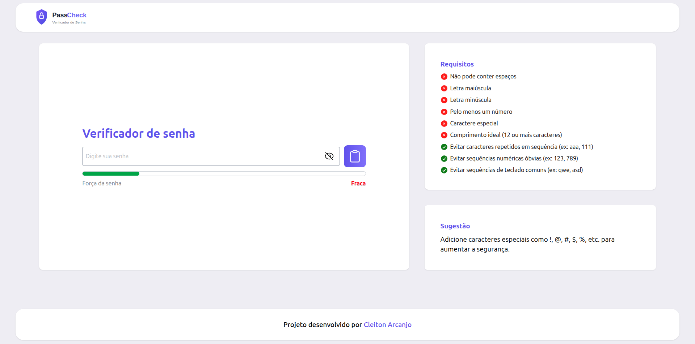

# passCheck

Um aplicativo de verificação de força de senha construído com **React**, **Vite** e **Tailwind CSS**.

🔗 **[Acessar o App](https://pass-check-coral.vercel.app/)**



## Descrição

O `passCheck` permite que o usuário digite uma senha e visualize em tempo real:
- força da senha via barra de progresso
- avaliação de segurança (Fraca / Média / Forte / Excelente)
- lista de requisitos atendidos ou não
- sugestão de melhoria para senha mais segura
- botão para copiar a senha para a área de transferência
- controle de mostrar/ocultar caracteres da senha

## Funcionalidades

- Validação instantânea dos critérios de senha
- Requisitos como:
  - não conter espaços
  - letras maiúsculas e minúsculas
  - números
  - caracteres especiais
  - comprimento mínimo
  - evitar repetições e sequências óbvias
- Feedback visual com ícones de sucesso/erro
- Interface responsiva com layout em grid

## Tecnologias

- React 19
- Vite
- Tailwind CSS 4
- ESLint

## Como usar

### Instalar dependências

```bash
npm install
```

### Iniciar em modo de desenvolvimento

```bash
npm run dev
```

### Build de produção

```bash
npm run build
```

### Pré-visualizar build

```bash
npm run preview
```

### Rodar lint

```bash
npm run lint
```

## Estrutura do projeto

- `src/App.jsx` - componente principal e estado global
- `src/components/Verificador.jsx` - entrada de senha, botão de copiar e barra de força
- `src/components/Requisitos.jsx` - lista de condições e avaliação de cada uma
- `src/components/Sugestao.jsx` - recomendações de segurança
- `src/components/NavBar.jsx` / `Footer.jsx` - cabeçalho e rodapé

## Observações

A aplicação é leve e pensada para ser um helper rápido na criação ou avaliação de senhas seguras.

## Autor
 
**Cleiton Arcanjo**
 
- LinkedIn: [Cleiton Arcanjo](https://www.linkedin.com/in/cleiton-arcanjo-614a6a36a/)
